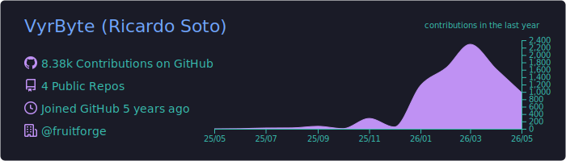
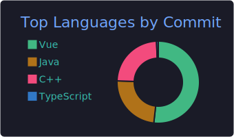
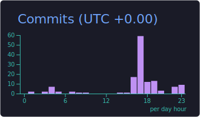

<div align="center">

# 👋 Hi, I'm Ricardo Soto

### FullStack Developer | Systems Engineering Student | DevOps Enthusiast

[](https://github.com/VyrByte)
[](https://github.com/VyrByte)

</div>

---

## 🚀 About Me

```
👨‍💻 FullStack Developer focused on backend technologies
🎓 Systems Engineering Student
🌱 Learning DevOps practices and cloud infrastructure
💡 Passionate about building scalable and efficient solutions
🐳 Exploring containerization and CI/CD workflows
🔧 Always curious about new technologies and best practices
```

---

## 💻 Tech Stack

### Languages


### Backend & Frameworks


### Databases


### DevOps & Cloud (Learning Path 🌱)


### Tools & Build Systems


---

## 🎯 Core Expertise

<table>
<tr>
<td width="50%" valign="top">

### 💻 Backend Development
- **RESTful API Design** & Implementation
- **Microservices Architecture** Patterns
- **Authentication & Authorization** (JWT, OAuth)
- **Database Design** & Optimization
- **WebSocket** & Real-time Features
- **API Documentation** (Swagger/OpenAPI)
- **Error Handling** & Logging Best Practices
- **Unit & Integration Testing**

</td>
<td width="50%" valign="top">

### 🗄️ Database Management
- **Relational Databases** (PostgreSQL, MySQL)
- **NoSQL Databases** (MongoDB)
- **Query Optimization** & Indexing
- **Data Modeling** & Schema Design
- **Caching Strategies** with Redis
- **Database Migrations** & Version Control
- **Backup & Recovery** Planning

</td>
</tr>
<tr>
<td width="50%" valign="top">

### 🌱 DevOps Journey
- **Docker** Containerization Basics
- **CI/CD Pipelines** with GitHub Actions
- **Cloud Deployment** Fundamentals
- **Version Control** with Git
- **Linux** Command Line
- **Nginx** & Reverse Proxy Setup
- **Environment Management** & Configuration
- **Monitoring** & Logging Basics

> *Currently expanding my knowledge in cloud infrastructure and automation!*

</td>
<td width="50%" valign="top">

### 🔧 Development Practices
- **Clean Code** Principles
- **Design Patterns** & SOLID
- **Agile Methodologies**
- **Code Review** Best Practices
- **Technical Documentation**
- **Problem Solving** & Debugging
- **Performance Optimization**
- **Collaborative Development**

</td>
</tr>
</table>

---

## 📊 GitHub Statistics

<div align="center">








</div>

---

## 📚 Currently Learning

- 🐳 Advanced Docker & Docker Compose
- ☸️ Kubernetes Fundamentals
- 🔄 CI/CD Pipeline Optimization
- ☁️ AWS Services & Architecture
- 🔐 Security Best Practices
- 📊 Monitoring & Observability Tools

---

## 📫 Get In Touch

<div align="center">

[](mailto:ricardo.s@teramont.net)
[](https://github.com/VyrByte)

</div>

---

<div align="center">

### 💭 "First, solve the problem. Then, write the code." - John Johnson


*Open to collaborations and always eager to learn!* 🚀

</div>
