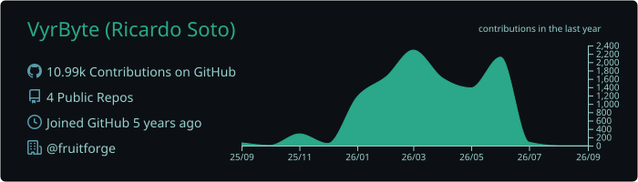
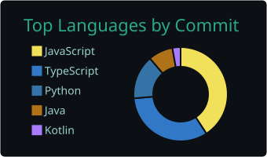
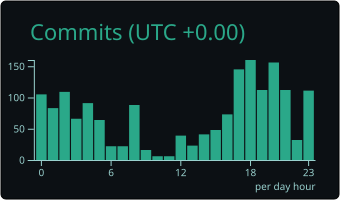

# Ricardo Soto

### Systems Engineer | Full-Stack Developer | Data Analyst & Scientist | DevOps Specialist

---

## Executive Summary

Systems Engineer specializing in scalable architecture, data analytics, and cloud infrastructure operations. Proven capabilities across the full software engineering lifecycle, combining strong Front-End product design with robust Back-End systems, data science workflows, and continuous integration pipelines.

---

## Technical Specializations & Roles

<table>
<tr>
<td width="33%" valign="top">

### Full-Stack Engineering
- **Front-End Emphasis:** Architecture of modular, responsive, and high-performance user interfaces.
- **Back-End Services:** Development of RESTful/GraphQL APIs, microservices, and secure authentication flows.
- **Client State & Optimization:** Advanced state management, client-side caching, and bundle size reduction.

</td>
<td width="33%" valign="top">

### Data Science & Analytics
- **Exploratory Analysis:** Statistical modeling, feature engineering, and data cleaning workflows.
- **Insight Extraction:** Transformation of complex datasets into actionable business intelligence.
- **Data Pipeline Operations:** Design and execution of ETL pipelines and database query optimization.

</td>
<td width="33%" valign="top">

### DevOps & Infrastructure
- **Containerization & Deployment:** Standardization of isolated environments via Docker.
- **CI/CD Automation:** Construction of reliable build, test, and release pipelines using GitHub Actions.
- **Cloud Administration:** Infrastructure provisioning, Linux server hardening, and reverse proxy setup.

</td>
</tr>
</table>

---

## Tech Stack & Tooling

### Languages & Runtimes

### Frameworks & Ecosystem

### Data Management, Caching & Analytics

### Infrastructure, Cloud & DevOps

---

## Analytics & Engineering Metrics

---

## Contact & Professional Links

